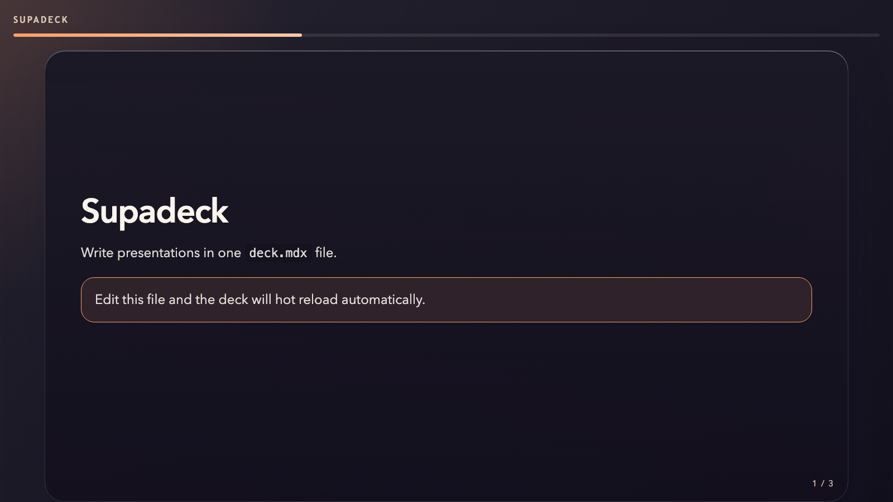
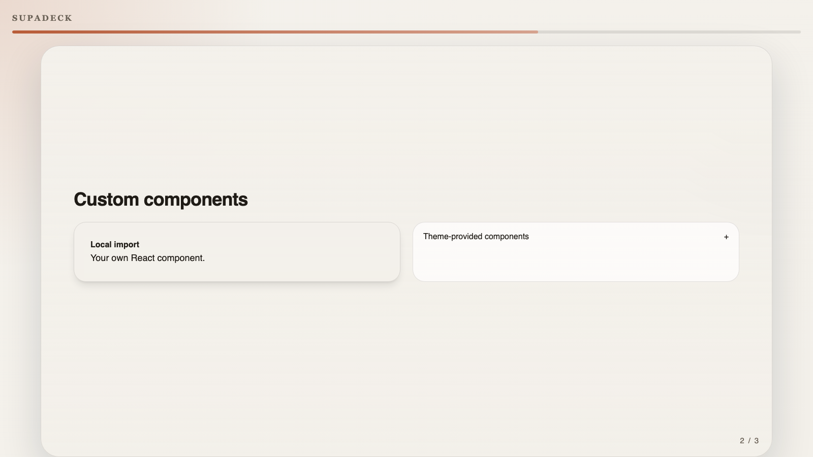
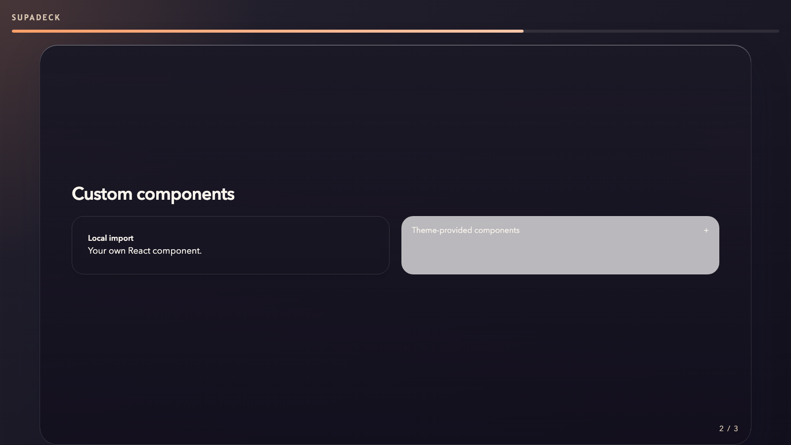
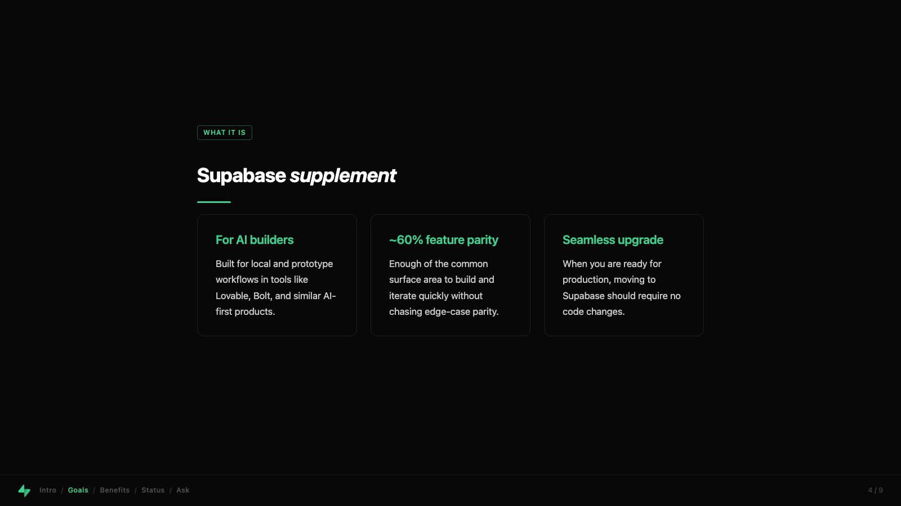
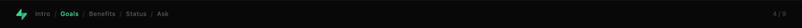

# Supadeck

Supadeck is a zero-config presentation toolkit for writing slide decks in MDX. You author your deck in `deck.mdx`, mix Markdown with React components, get a hot-reloading Vite runtime while you edit, pick from built-in themes or bring your own, and export the finished deck to PDF when it is ready to share.

## Quickstart

```bash
npx supadeck
```

That single command looks for `deck.mdx` in the current directory, creates `deck.mdx` and `ExampleCard.tsx` if they do not exist yet, and starts the local presentation runtime. As you edit the deck or update local components imported from your workspace, the deck reloads immediately.



## Why Supadeck

- Write a deck in one `deck.mdx` file.
- Mix Markdown, JSX, and local React imports in the same slide deck.
- Use a themeable runtime instead of a fixed presentation shell.
- Start with built-in themes and switch with frontmatter or `--theme`.
- Use GitHub Flavored Markdown features like tables, task lists, and strikethrough.
- Navigate with the keyboard or directly via slide hashes like `#3`.
- Export the rendered deck to PDF with one command.

## What's Supported

### Authoring

- Frontmatter-driven deck config: `title`, `theme`, `aspectRatio`, `showSlideNumbers`, `transition`, and `sections`.
- Slide content written in MDX with JSX support.
- Optional import prelude after frontmatter for local components and helpers.
- Slide boundaries defined by thematic breaks (`---`).
- Built-in MDX components for headings, lists, tables, callouts, layout helpers, and more.
- GitHub Flavored Markdown through `remark-gfm`, including tables, task lists, and strikethrough.

### Runtime

- Interactive browser presentation runtime powered by Vite and React.
- Keyboard navigation with `Arrow` keys, `PageUp`, `PageDown`, `Home`, `End`, and `Space`.
- URL hash navigation so slide state is reflected in the address bar.
- Theme-controlled deck rendering for both default and custom layouts.
- Interactive mode for presenting and print mode for export.

### Export

- `supadeck export` builds the deck to HTML first, then prints it to PDF.
- PDF export uses Playwright Chromium in headless mode.
- Slide backgrounds are preserved during PDF generation.

### Customization

- Theme selection by built-in id, relative theme file path, or theme directory.
- Theme-provided MDX component overrides and custom deck layouts.
- Workspace component imports inside `deck.mdx`.
- Theme setup hooks for runtime styling and root-level behavior.

## Built-in Themes

Supadeck currently ships with three built-in themes:

| Theme | Best for | What makes it distinct |
| --- | --- | --- |
| `default` | General-purpose decks | Clean deck chrome, slide numbers, progress UI, and the default MDX component set. |
| `sunset` | Brighter keynote-style decks | Reuses the default layout with a warmer visual treatment and color palette. |
| `supabase` | Branded product or pitch decks | Custom stage layout, footer breadcrumbs, branded components, and optional section navigation. |





For the `supabase` theme, `sections` in frontmatter define 1-based inclusive slide ranges. 

```yaml
---
title: supalite
theme: supabase
sections:
  - label: Intro
    start: 1
    end: 1
  - label: Goals
    start: 2
    end: 4
---
```

Those ranges are normalized onto the deck and used to render the footer breadcrumb navigation.



## Quick Deck Authoring

Here is a compact `deck.mdx` that shows the core authoring model: frontmatter, a local React import, theme-provided components, GitHub Flavored Markdown, and a code block.

````mdx
---
title: Ship Review
theme: sunset
aspectRatio: 16:9
showSlideNumbers: true
transition: fade
---

import ExampleCard from "./ExampleCard.tsx";

# Ship Review

<Callout tone="accent">
  One file for the whole deck, with local components when you need them.
</Callout>

<Columns
  left={
    <ExampleCard title="Status">
      Ready for internal review.
    </ExampleCard>
  }
  right={
    <Disclosure title="Next step">
      Export a PDF for async feedback.
    </Disclosure>
  }
/>

---

## Rollout snapshot

| Area | Status |
| --- | --- |
| Runtime | Ready |
| Theme | Sunset |
| Export | PDF |

- [x] Deck authored in MDX
- [ ] Final rehearsal

```ts
export function ship() {
  return "present";
}
```
````

## Deck File Format

Supadeck reads `deck.mdx` using this model:

1. Optional YAML frontmatter at the top defines deck config.
2. An optional import prelude can come immediately after frontmatter.
3. Slides are split by thematic breaks written as `---`.
4. If no slide separators are present, the full file becomes a single slide.
5. Anything imported in the prelude is available inside slide JSX and MDX.

Slide splitting is syntax-aware. A literal `---` inside fenced code does not create a new slide.

## CLI Reference

### Start a deck in the current directory

```bash
npx supadeck
```

Looks for `./deck.mdx` and scaffolds a starter deck unless you pass `--no-create`.

### Start a deck from a workspace directory

```bash
npx supadeck ./talks/keynote
```

If the input has no extension, Supadeck resolves it as `./talks/keynote/deck.mdx`.

### Start with overrides

```bash
npx supadeck ./talks/keynote --theme sunset --open --port 4000
```

### Export the current deck

```bash
npx supadeck export
```

Exports to a PDF next to the input deck. For `deck.mdx`, the default output is `deck.pdf`.

### Export a specific deck to a custom path

```bash
npx supadeck export ./talks/keynote --output keynote.pdf
```

Supadeck supports these CLI flags today:

| Flag | Meaning |
| --- | --- |
| `--open` | Open the dev server in a browser. |
| `--no-create` | Skip starter deck scaffolding in dev mode. |
| `--port <number>` | Choose the Vite dev server port. |
| `--output <path>` | Choose the PDF output path during export. |
| `--theme <id-or-path>` | Override the deck theme from the CLI. |

## Custom Components

There are two supported ways to bring custom UI into a deck:

1. Import local components directly inside `deck.mdx`.
2. Expose components from a theme via `theme.components`.

The starter workflow uses a local component import:

```mdx
import ExampleCard from "./ExampleCard.tsx";

<ExampleCard title="Local import">
  Your own React component.
</ExampleCard>
```

When you edit imported workspace components, Supadeck updates the deck runtime as part of the normal development loop.

Themes can also inject components directly into MDX so you can write things like `<Callout />`, `<Disclosure />`, or a theme-specific component such as `<SupabaseMark />` without importing each usage manually.

## GitHub Flavored Markdown

Supadeck enables GitHub Flavored Markdown through `remark-gfm`, so the following features work in deck content:

```md
| Name | Value |
| --- | --- |
| Cold start | <1s |

~~deprecated copy~~

- [x] Ship deck
- [ ] Rehearse

> This quote renders through the deck's blockquote component.
```

These features render through the active theme's MDX component mapping, so tables and other elements pick up theme styling instead of falling back to unstyled raw HTML.

## Creating Your Own Theme

A custom theme is just a module that matches the `ThemeModule` shape. It can provide a custom deck renderer, MDX components, and a setup hook.

Create a theme file such as `./themes/my-theme/index.tsx`:

```tsx
import type { ThemeModule } from "supadeck";
import { DefaultDeck, createDefaultComponents } from "supadeck";
import "./theme.css";

const myTheme: ThemeModule = {
  Deck: DefaultDeck,
  components: {
    ...createDefaultComponents(),
    h1: (props) => <h1 className="text-7xl font-black tracking-tight" {...props} />,
  },
  setup({ config, rootElement, helpers }) {
    rootElement.style.setProperty(
      "--slide-aspect-ratio",
      helpers.parseAspectRatio(config.aspectRatio)
    );
    rootElement.dataset.transition = config.transition ?? "fade";
  },
};

export default myTheme;
```

Then point your deck at it:

```yaml
---
theme: ./themes/my-theme
---
```

Theme resolution supports:

- Built-in ids like `default`, `sunset`, and `supabase`
- Relative theme files like `./my-theme.tsx`
- Theme directories with an `index.tsx`, `index.ts`, `index.jsx`, or `index.js`

The `ThemeModule` contract supports these keys:

- `Deck` for a custom deck renderer
- `components` for MDX tag overrides and theme-provided components
- `setup` for runtime initialization and cleanup

Import your CSS from the theme entry so the theme can own its visual system in one place.

## Public Runtime Exports for Theme Authors

Supadeck also exports a small toolbox for theme authors:

- `createDefaultComponents`
- `mergeComponents`
- `useCurrentSlide`
- `SlideFrame`
- `DeckSlide`
- `DeckChrome`
- `DeckNavigation`
- `DeckProgress`
- `DeckTitle`
- `DefaultDeck`
- `Callout`
- `Columns`
- `Disclosure`
- `Frame`

You can use these as building blocks instead of starting every theme from scratch.

## Exporting to PDF

```bash
npx supadeck export
```

Export runs the deck in print mode, builds the static HTML output, opens it in headless Chromium, and writes a PDF with backgrounds enabled.

If Chromium is not available locally, install it first:

```bash
npx playwright install chromium
```

## Limits / Current Boundaries

- PDF export depends on Playwright Chromium being installed and available locally.
- Only the documented built-in themes ship with the package.
- Supadeck supports the current theme transition model; it does not currently document speaker notes, presenter tools, remote control, or richer animation systems.

## Examples

- [`examples/dev/deck.mdx`](examples/dev/deck.mdx)
- [`examples/supabase/deck.mdx`](examples/supabase/deck.mdx)
